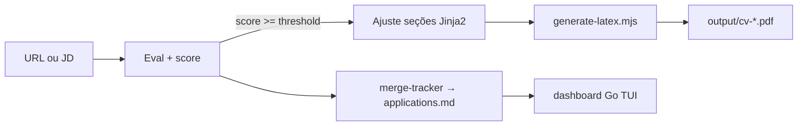

# Planejamento — career-ops (LaTeX + tex-docctor + dashboard)

Escopo: instância local em  
`/home/mauro/development/PROJECTS_OUTPLACEMENT/job-search-tooling/career-ops/`

Referência upstream (monorepo):  
`/home/mauro/development/PROJECTS_OUTPLACEMENT/docs/roadmap/latex-output-adapter.md`

---

## Objetivo

Integrar career-ops com **tex-docctor** (workspace Jinja2 modular) como backend LaTeX padrão, manter **native** (sb2nov + tectonic) como fallback, expor MCP nos tool-sets, e operar fluxo completo eval → PDF → tracker com dashboard Go.

---

## Fases — status

| # | Fase | Repo | Status |
|---|------|------|--------|
| 1 | `scripts/` → `src/` + refs | career-ops | ✅ 166 tests pass |
| 2a | MCP tex-docctor (`doctor`, `build`, `init`, `clean`) | tool-set/tex-docctor | ✅ 6/6 |
| 2b | MCP typoruler (baseline QA) | tool-set/typoruler | ✅ 6/6 |
| 3 | Adapter LaTeX (`generate-latex.mjs` + backends) | career-ops | ✅ |
| 4 | Testes adapter + integração `test-all` | career-ops | ✅ |
| 5 | E2E PDF Mauro via tex-docctor | career-ops | ✅ 107.3 KB |
| 6 | User-layer Mauro (`profile.yml`, `cv.md`, etc.) | career-ops | ✅ |
| 7 | Doctor + sync-check + verify | career-ops | ✅ |
| 8 | Dashboard Go build | career-ops | ❌ `go` não instalado |
| 9 | Batch LaTeX (`batch-prompt.md`) | career-ops | ⏸ pendente (ainda HTML) |

---

## Stack configurada (Mauro)

| Componente | Valor |
|------------|--------|
| `language.modes_dir` | `modes/pt` |
| `cv.output_format` | `latex` |
| `cv.latex_backend` | `tex-docctor` |
| `cv.tex_docctor.project_dir` | `.../mauro-cv-oficial/.build-workspace` |
| `auto_pdf_score_threshold` | `4.0` |

### Arquivos user-layer (gitignored)

| Arquivo | Status |
|---------|--------|
| `config/profile.yml` | ✅ |
| `cv.md` | ✅ |
| `modes/_profile.md` | ✅ |
| `portals.yml` | ✅ |
| `data/applications.md` | ✅ (vazio) |

---

## Adapter LaTeX

```
src/generators/
  generate-latex.mjs          # facade CLI
  latex/
    contract.mjs
    index.mjs                 # loadLatexConfig, resolveBackend
    native-backend.mjs        # sb2nov + tectonic/pdflatex
    tex-docctor-backend.mjs   # tex-docctor build + copy PDF
```

### Seleção de backend

| `latex_backend` | Comportamento |
|-----------------|---------------|
| `native` | Valida `templates/cv-template.tex`; compila `.tex` da CLI |
| `tex-docctor` | Build no `project_dir`; copia `out/main.pdf` → destino |

**Nota:** com tex-docctor, personalização por vaga edita `{project_dir}/src/secoes/` — não usa `cv-template.tex`.

---

## Fluxo operacional



1. Colar URL/JD → agente eval (`modes/pt`)
2. Score ≥ `auto_pdf_score_threshold` → modo `latex` (`modes/latex.md`)
3. Agente edita `{project_dir}/src/secoes/` conforme JD
4. `node src/generators/generate-latex.mjs output/cv-….tex output/cv-….pdf`
5. Tracker TSV → `npm run merge`

Setup detalhado: [`LOCAL-SETUP.md`](LOCAL-SETUP.md)

---

## Verificação executada (2026-06-03)

```bash
npx playwright install chromium   # ✅
npm run doctor                    # ✅ all checks passed
npm run sync-check                # ✅
npm run verify                    # ✅ pipeline clean
npm run test:latex-adapter        # ✅ 4/4
node src/tests/test-all.mjs --quick  # ✅ 166 passed
node src/generators/generate-latex.mjs output/.probe.tex output/.probe.pdf --backend=tex-docctor
# ✅ compiled, 107.3 KB
```

---

## O que falta para fluxo completo

### Obrigatório / bloqueante

| Item | Comando / ação |
|------|----------------|
| **Go 1.21+** (dashboard) | `sudo apt install golang-go` ou [go.dev](https://go.dev/dl/) → `npm run dashboard:build` |
| **Cursor CLI (`agent`)** | Eval + pipeline interativo no diretório career-ops |

### Recomendado

| Item | Motivo |
|------|--------|
| `article-digest.md` | Proof points para matching (sync-check avisa se >30d) |
| `interview-prep/story-bank.md` | STAR+R acumulado |
| `writing-samples/` | Calibração de voz |
| MCP Cursor (`tex-docctor-mcp`, `typoruler-mcp`) | Build/QA via agente IDE — ver `LOCAL-SETUP.md` |
| Rebuild workspace após mudança base CV | `bash docs/curriculum-vitae/build-cv.sh mauro-cv-oficial` no repo tex-docctor |

### Opcional

| Item | Motivo |
|------|--------|
| `.env` + `GEMINI_API_KEY` | Só para `npm run gemini:eval` (Gemini CLI) |
| `tectonic` | tex-docctor doctor avisa missing; **latexmk ok** — build funciona |
| Batch LaTeX | `batch/batch-prompt.md` ainda aponta `generate-pdf.mjs` — usar pipeline interativo |

### Env overrides (tex-docctor)

| Variável | Uso |
|----------|-----|
| `CAREER_OPS_TEX_DOCCTOR_PROJECT_DIR` | Override `project_dir` |
| `CAREER_OPS_TEX_DOCCTOR_CLI` | Path absoluto do CLI |
| `TEX_DOCCTOR_ROOT` | Auto-resolve `.venv` / `uv run` |

---

## MCP (tool-sets)

### tex-docctor

| Tool | Função |
|------|--------|
| `doctor` | Checa latexmk/tectonic |
| `build` | Compila workspace |
| `init` | Scaffold template |
| `clean` | Limpa out/build |

### typoruler

QA tipográfico PDF vs baseline — **não compila LaTeX**.

---

## Limitações conhecidas

- Batch mode HTML-only até atualizar `batch/batch-prompt.md`
- Doctor exige Playwright mesmo com `output_format: latex` (legado HTML path)
- `npm run pdf` = HTML/Playwright; LaTeX = `generate-latex.mjs` ou agente `/career-ops pdf` com profile latex

---

## Próximo passo imediato

```bash
# 1. Instalar Go
sudo apt install golang-go   # ou tarball go.dev

# 2. Dashboard
cd /home/mauro/development/PROJECTS_OUTPLACEMENT/job-search-tooling/career-ops
npm run dashboard:build
npm run dashboard

# 3. Primeira vaga real
agent   # colar URL → eval → LaTeX PDF → merge tracker
```

Debug: [`docs/DEBUG.md`](DEBUG.md) — perfis Go + Node em `tool-set/.vscode/launch.json`.
